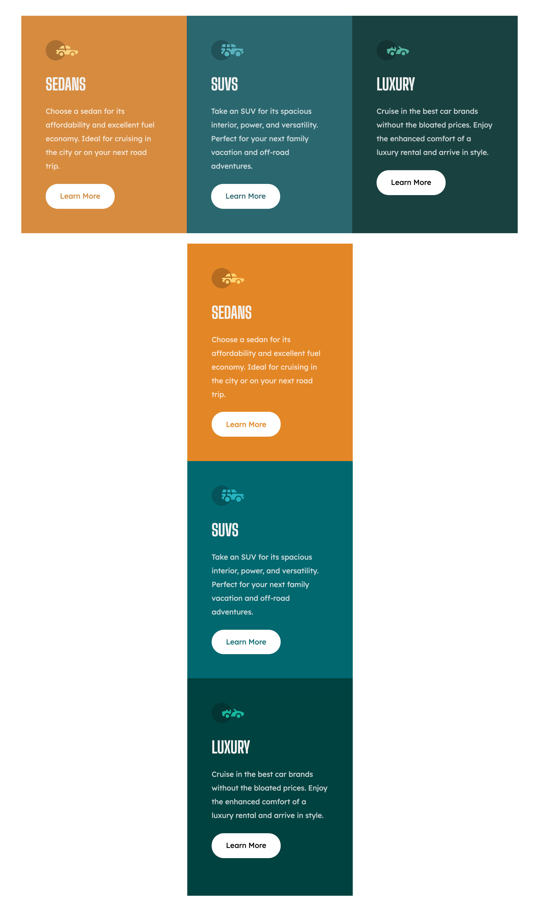

# Frontend Mentor - 3-column preview card component solution

This is a solution to the [3-column preview card component challenge on Frontend Mentor](https://www.frontendmentor.io/challenges/3column-preview-card-component-pH92eAR2-). Frontend Mentor challenges help you improve your coding skills by building realistic projects. 

## Overview

### The challenge

Users should be able to:

- View the optimal layout depending on their device's screen size
- See hover states for interactive elements

### Screenshot

### Links

- Solution URL: (https://github.com/aeromax/front-end-mentor-projects/tree/main/3-column-preview-card-component-main)
- Live Site URL: (https://aeromax.github.io/front-end-mentor-projects/3-column-preview-card-component-main/)

## My process

### Built with

- Semantic HTML5 markup
- CSS custom properties
- Flexbox
- Mobile-first workflow

### What I learned

I've gotten much more efficient at using flexbox, as well as labeling my CSS more semantically and simply. One new thing I accomplished with this project was avoiding use of inner wrappers inside each element, instead choosing to use padding to add space around the content.

## Author

[My GitHub](https://github.com/aeromax)
- Frontend Mentor - [@aeromax](https://www.frontendmentor.io/profile/aeromax)