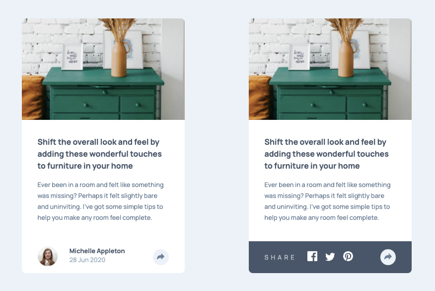
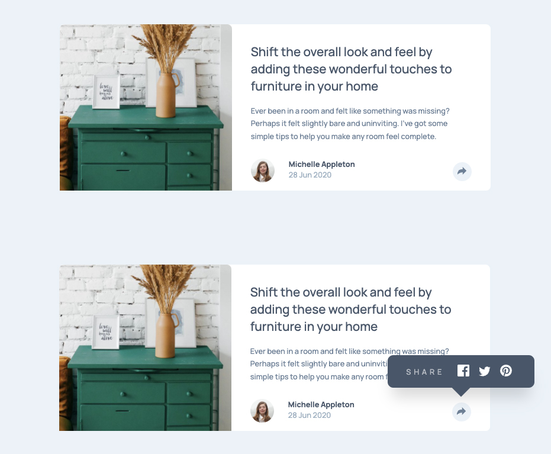

# Frontend Mentor - Article preview component solution

This is a solution to the [Article preview component challenge on Frontend Mentor](https://www.frontendmentor.io/challenges/article-preview-component-dYBN_pYFT). Frontend Mentor challenges help you improve your coding skills by building realistic projects. 

## Overview

### The challenge

Users should be able to:

- View the optimal layout for the component depending on their device's screen size
- See the social media share links when they click the share icon

### Screenshot

### Links

- Solution URL: (https://github.com/aeromax/front-end-mentor-projects/tree/main/7-%20article-preview-component-master)
- Live Site URL: (https://aeromax.github.io/front-end-mentor-projects/7-%20article-preview-component-master/)

## My process

### Built with

- Semantic HTML5 markup
- CSS custom properties
- Flexbox

### What I learned

This was the first project I took on where the desktop and mobile presentation of a particular feature was very different from eachother. I found myself going back and forth between the desktop and mobile styles over and over again, and rebuilding parts of the share-toggle because of the complicated positioning and display variations I had to figure out.

## Author

- Website - (https://github.com/aeromax)
- Frontend Mentor - [@aeromax](https://www.frontendmentor.io/profile/aeromax)
