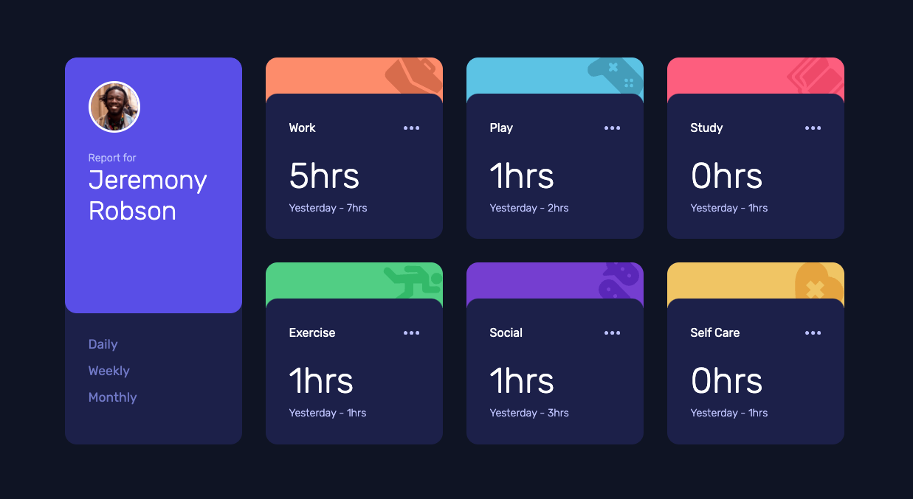
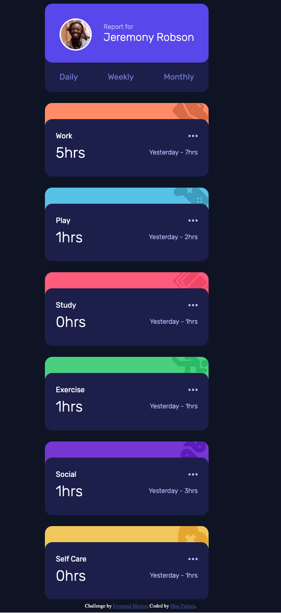

# Frontend Mentor - Time tracking dashboard solution

This is a solution to the [Time tracking dashboard challenge on Frontend Mentor](https://www.frontendmentor.io/challenges/time-tracking-dashboard-UIQ7167Jw). Frontend Mentor challenges help you improve your coding skills by building realistic projects. 

## Overview

### The challenge

Users should be able to:

- View the optimal layout for the site depending on their device's screen size
- See hover states for all interactive elements on the page
- Switch between viewing Daily, Weekly, and Monthly stats

### Screenshot




### Links

- Solution URL: (https://github.com/aeromax/front-end-mentor-projects/tree/main/8-%20time-tracking-dashboard-main)
- Live Site URL: (https://aeromax.github.io/front-end-mentor-projects/8-%20time-tracking-dashboard-main)

### Built with

- Semantic HTML5 markup
- CSS custom properties
- Flexbox
- CSS Grid
- Custom JS

### What I learned

This project took a very long time for me to complete, because I still need a lot of practice thinking about my process when approaching javascript. I ended up refactoring, adding, and deleting a lot of my functions as I went. I learned a bit more about how to fetch external data using the `fetch()` API:
```
function getData() {
    return fetch('data.json')
        .then(data => {
            console.log('getData');
            return data.json();
        })
        .then(data => {
            return data;
        })
        .catch(error => {
            console.log(`Error fetching data: ${error} background-color:white;color:red`);
        });
}
```

I also learned about using template literals, and how I can use them to insert variables into various elements.
```
let element =`
            <div class="card ${(card.title.toLowerCase()).replace(/\s/g, "-")}"> 
            <div class="decoration"></div> 
            <div class="deco-radius"></div>
            <div class="content"> 
            <div class="title">${(title)}
            <span class="ellipsis"></span>
            </div> 
            <div class="times">
            <div class="current">${(times.current)}hrs</div> 
            <div class="previous">
            <span class="previous-timeframe">${(times.previousTimeframe)}</span> - <span class="previous-hours">${(times.previous)}hrs</span></div> 
            </div> 
            </div>
            </div>
            `;
```

### Continued development

For future projects, I'm going to try psuedo-coding my functions first before I write any scripts. I would also like to research a cleaner way to update elements on the page than what I currently have.

## Author

- GitHub - (https://github.com/aeromax)
- Frontend Mentor (https://www.frontendmentor.io/profile/aeromax)

## Acknowledgments

Thanks to Michael Kipchumba on the Front End Mentor slack channel for explaining why I was having so much trouble with my event listeners.