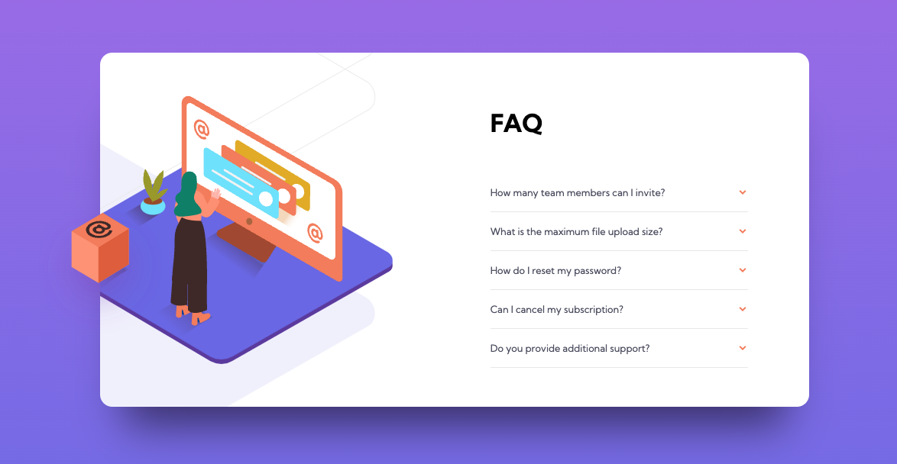
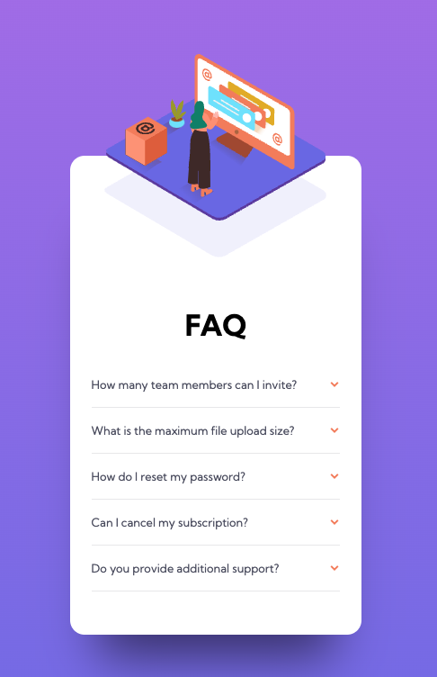

# Frontend Mentor - FAQ accordion card solution

This is a solution to the [FAQ accordion card challenge on Frontend Mentor](https://www.frontendmentor.io/challenges/faq-accordion-card-XlyjD0Oam). Frontend Mentor challenges help you improve your coding skills by building realistic projects. 

## Overview

### The challenge

Users should be able to:

- View the optimal layout for the component depending on their device's screen size
- See hover states for all interactive elements on the page
- Hide/Show the answer to a question when the question is clicked

### Screenshot

### Links

- Solution URL:(https://github.com/aeromax/front-end-mentor-projects/tree/main/faq-accordion-card-main)
- Live Site URL:(https://aeromax.github.io/front-end-mentor-projects/faq-accordion-card-main/)

### Built with

- Semantic HTML5 markup
- CSS custom properties
- Flexbox
- CSS Grid
- Mobile-first workflow
- Radio button hack for JS-free accordions!

### What I learned

Even though this was an "easy" project, this was a significantly bigger challenge than before.

I started this project the same as the rest, by tackling the mobile view first, and defining my main content blocks first. I ended up tackling the layered images at the top with two different divs with background images applied, inside of a parent div with a couple negative margins applied to move them into place outside of the frame of the card.

However once I started setting styles for the desktop version, I ended up spending a lot of time repositioning the layered images properly, so I did have to recode that section entirely for it to work better. This involved making the bottom-most image layer part of the card background, instead of it's own div in the hero area. 

On the plus side, I was able to complete the bonus part, which was to make accordions without using any JS. I found an easily method of doing this using radio buttons. In additon to being script-free, I imagine that this might be better for accessibility as well.

## Author

[My GitHub](https://github.com/aeromax)

Frontend Mentor - [@aeromax](https://www.frontendmentor.io/profile/aeromax)

## Acknowledgments

This [Tuts Plus article](https://webdesign.tutsplus.com/tutorials/accordion-component-with-css-checkbox-hack--cms-34105) from [George Martsoukos](https://georgemartsoukos.com/) helped me accomplish building accordions without any javascript, using the checkbox hack.

