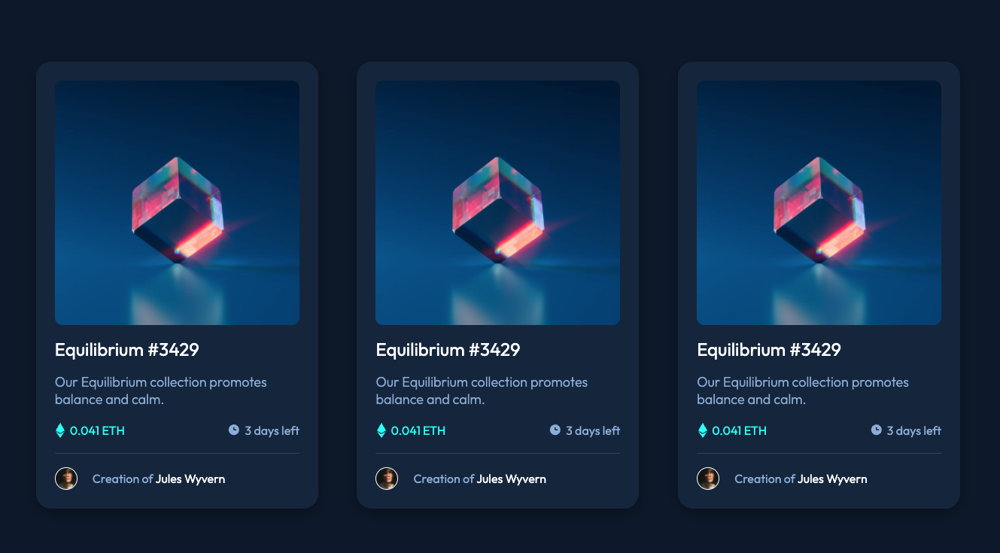

# Frontend Mentor - NFT preview card component solution

This is a solution to the [NFT preview card component challenge on Frontend Mentor](https://www.frontendmentor.io/challenges/nft-preview-card-component-SbdUL_w0U). Frontend Mentor challenges help you improve your coding skills by building realistic projects. 

## Table of contents

- [Overview](#overview)
  - [The challenge](#the-challenge)
  - [Screenshot](#screenshot)
  - [Links](#links)
- [My process](#my-process)
  - [Built with](#built-with)
  - [What I learned](#what-i-learned)
  - [Continued development](#continued-development)
  - [Useful resources](#useful-resources)
- [Author](#author)
- [Acknowledgments](#acknowledgments)

## Overview

### The challenge

Users should be able to:

- View the optimal layout depending on their device's screen size
- See hover states for interactive elements

### Screenshot

### Links

- Solution URL: (https://github.com/aeromax/front-end-mentor-projects/tree/main/nft_preview_card_component)
- Live Site URL: (https://aeromax.github.io/front-end-mentor-projects/nft_preview_card_component/)

### Built with

- Semantic HTML5 markup
- CSS custom properties
- Flexbox

### What I learned

With this project, I decided to practice my use of using flexbox in my CSS. This proved to be a great way to space things out and get them aligned quickly. Although I know a bit of SASS, I decided to start learning about CSS variables instead, as this was a small project which I felt didn't require the use of a large amount of pre-processing.

### Continued development

In the future, I want to learn a cleaner way to write more semantic CSS classes.

### Useful resources

- [CSS-tricks.com FlexBox cheat sheet](https://css-tricks.com/snippets/css/a-guide-to-flexbox/) - I found this great cheat sheet for flexbox which helped me figure out which flexbox options I needed, and how to apply them.

## Author

- My design website - (https://maxpalmer.design)
- My GitHub - (https://github.com/aeromax)
– My LinkedIn - (https://www.linkedin.com/in/maxpalmer/)
